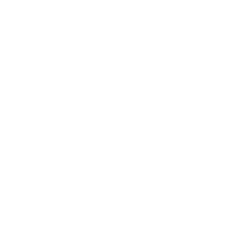
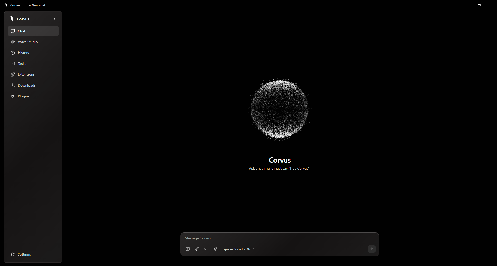

<p align="center">
  
</p>

<h1 align="center">Corvus</h1>

<p align="center">
  <strong>Your AI, living on <em>your</em> PC</strong><br/>
  Local-first. Private by design. No cloud required.
</p>

<p align="center">
  <a href="https://github.com/VenomDevX/CORVUS/releases/latest"></a>
  
  
  
</p>

---

<p align="center">
  
</p>

---

## ✨ What is Corvus?

Corvus is a **Windows desktop AI assistant** — an animated, voice-ready companion that lives in your taskbar, remembers what matters, and acts on your behalf across the OS and the web. Everything runs **100% locally on your machine** — your conversations, your data, and your AI models never leave your PC.

## 🚀 Features

### 💬 Multi-Provider Chat
- Stream responses from **local Ollama models** or cloud providers (OpenAI, Anthropic, Gemini, DeepSeek)
- API keys encrypted via **Windows DPAPI** — never stored in plaintext
- Switch models on the fly from the chat input bar

### 🎙️ Voice Pipeline
- **"Hey Corvus"** wake word detection — just speak naturally
- Local speech-to-text via **Whisper**
- Neural text-to-speech with **barge-in** support (interrupt Corvus mid-sentence)

### 🧠 Memory & History
- Persistent chat history stored in **SQLite**
- Inspectable memory — see exactly what Corvus remembers
- Context-aware responses that improve over time

### 🤖 OS Agent
- Controls Windows through a **permissioned action registry**
- Exact-consequence confirmations before any system action
- Browser automation via **Playwright** (navigate, research, extract data)
- **Computer vision** — OCR screenshots, understand what's on screen, click UI elements

### 🎨 Media Studio
- Voice Studio for audio generation and management
- File attachments — drag and drop any file into the chat
- Rich media rendering in conversations

### ⏰ Tasks & Automation
- Native **notifications, timers, and reminders**
- User-definable **workflows** with manual, scheduled, or voice triggers
- Background task management

### 🧩 Plugin System
- **Plugin SDK** with a built-in marketplace
- Per-plugin permissions for security
- Extend Corvus with community or custom plugins

### 🔧 Production Ready
- **Windows installer** (NSIS) with **auto-update** support
- **Crash recovery** with session restore and rotating logs
- First-run onboarding wizard with **automated Ollama installation**
- Hardware-aware model recommendations

---

## 📦 Installation

### Quick Install (Recommended)

1. **Download** the latest `Corvus-Setup-x.x.x.exe` from the [Releases page](https://github.com/VenomDevX/CORVUS/releases/latest)
2. **Run** the installer — it will guide you through first-time setup
3. **Corvus automatically installs Ollama** if it isn't already on your machine
4. **Pick a model** — Corvus recommends the best one for your hardware

### Prerequisites

| Requirement | Version |
|-------------|---------|
| Windows | 10 / 11 |
| Node.js | ≥ 22 |
| Python | ≥ 3.11 |

---

## 🛠️ Development Setup

```powershell
# Clone the repository
git clone https://github.com/VenomDevX/CORVUS.git
cd CORVUS

# Install root dependencies
npm install

# Install frontend dependencies
npm install --prefix frontend

# Set up the Python backend
cd backend
python -m venv .venv
.venv\Scripts\pip install -e .[dev]
cd ..
```

### Run in Development Mode

```powershell
npm run dev      # Starts FastAPI backend, Vite dev server, and Electron together
```

### Build the Installer

```powershell
cd backend
.venv\Scripts\pip install -e .[dev,build]
cd ..
npm run dist     # Freezes backend (PyInstaller) + packages app (electron-builder)
```

Output: `dist-installer/Corvus-Setup-<version>.exe`

---

## 📂 Project Structure

```
Corvus/
├── backend/              # Python FastAPI backend
│   ├── corvus/
│   │   ├── api/          # REST + WebSocket endpoints
│   │   ├── llm/          # LLM provider integrations (Ollama, OpenAI, etc.)
│   │   ├── memory/       # SQLite memory & history
│   │   ├── voice/        # Wake word, STT, TTS pipeline
│   │   ├── agent/        # OS automation & browser control
│   │   └── plugins/      # Plugin SDK & marketplace
│   └── tests/
├── frontend/             # Electron + React + Vite
│   ├── electron/         # Main process (IPC, tray, updater)
│   ├── src/
│   │   ├── components/   # React components
│   │   ├── sections/     # Page-level views
│   │   ├── lib/          # API client, Ollama helpers
│   │   └── state/        # Global state management
│   └── tests/
├── design/               # Logo, icons, and brand assets
└── dist-installer/       # Built installer output
```

---

## 🧪 Other Commands

```powershell
npm run guard    # Naming lint (product name must be "Corvus" everywhere)
npm test         # Guard + frontend Vitest + backend Pytest
npm run assets   # Re-export logo SVGs to ICO/PNG (design/exports)
```

---

## 🔐 Security

- **Local-first architecture** — all data stays on your machine
- **Windows DPAPI encryption** for API keys
- **Per-launch backend auth tokens** — every Electron session generates a fresh token
- **Navigation guards** — Corvus windows only load local content; external links open in the system browser
- **Blocked executable extensions** — prevents opening dangerous file types
- **Permissioned agent actions** — every OS action requires user confirmation

---

## 📄 License

Proprietary — All rights reserved.

---

<p align="center">
  
  <br />
  <sub>Built with ❤️ by <a href="https://github.com/VenomDevX">VenomDevX</a></sub>
</p>
